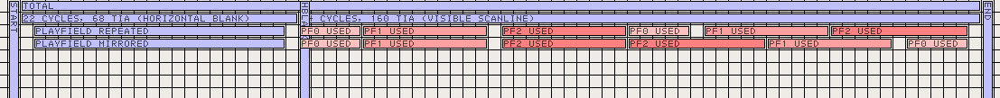

FridgeGrid
==========

FridgeGrid is a tool intended to help planning cycle exact code for effects on
old school hardware.

Think of it as a combination of grid paper and fridge magnets in digital form
with save and load functions.

Originally developed for creating Atari 2600 VCS demos, it was extended be
usable for other systems as well. Templates include also the VIC-20 and the
C64.

This is an example what it looks like:

A more detailed example is available at https://xayax.net/tools/fridgegrid/

Packaging
---------
Packaging is rather forward

1) Debian, Ubuntu, etc.

   Packages for Debian, Ubuntu and alike can be build using the
   `dpkg-buildpackage` tool.

2) OpenSuSE, Red-Hat, etc.

   Not supported yet. If someone provides mit with a proper build spec file,
   I'm including it.

3) Windows

   Windows is cross-build usine the [mxe](http://mxe.cc) toolchain installed at
   `/opt/mxe`. Parameters are at the top of the build shell script.

4) Mac OS X

   Same as Windows, but a different build script will be used to create a dmg
   containing the application.

